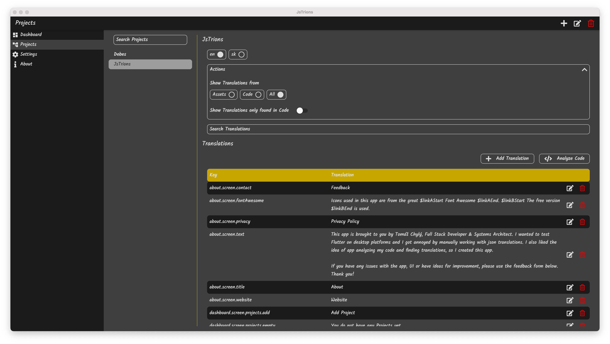
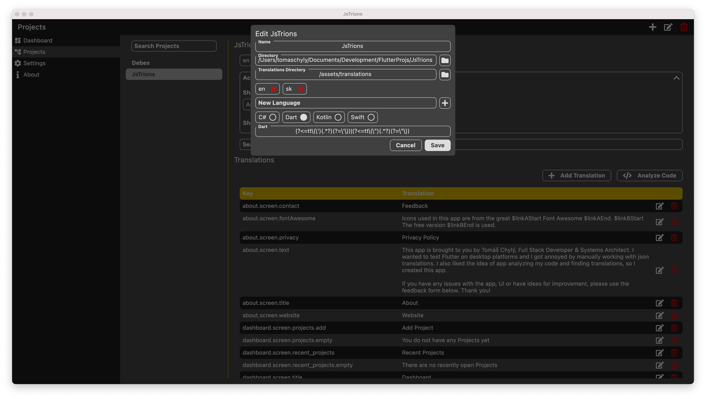
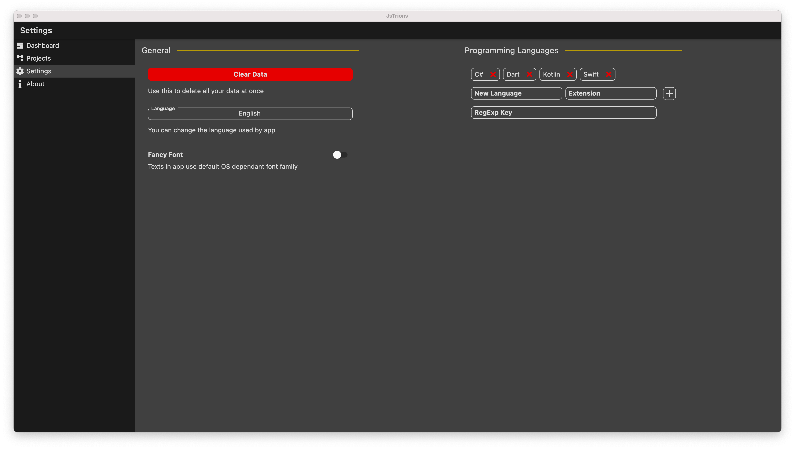

# JsTrions

Flutter cross-platform JSON translations utility app.

Easily manage JSON translations in your project. Should support any framework, programming language. 

Use JsTrions to analyze project code for translations usage, you can then easily see which translations are missing and add them.

You can also use automatic translations from one language to other languages.

App works fully offline, so it is not dependant on some online service.

JsTrions works well with Translator provided by my Flutter package [tch_appliable_core](https://github.com/tomaschyly/tch_appliable_core), but is compatible with any simple json translations.

## App Gallery

